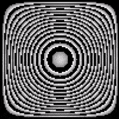

Вы никогда не задумывались, как можно связать такую неосязаемую вещь, как творчество, со строгой математикой? Однажды меня посетила мысль: что будет, если взять точку на плоскости в определенный момент времени и задать ей цвет?

## 0. Первые шаги

Для быстрой проверки идеи я решил проводить эксперименты в браузере, рисуя на элементе [*canvas*](https://developer.mozilla.org/ru/docs/Web/API/Canvas_API).
Пусть у нас имеется плоскость размера `N*N`. Для простоты возьмем `N = 100`.
Далее возникает вопрос: как описать функцию `f`?
Немного поэкспериментировав с видом функции и получаемыми значениями, я пришел к одному красивому узору,
описываемому очень простой функцией:
```javascript
function f(x, y, t) {
  return x * y * t;
}
```
Где `(x, y)` - координаты точки на плоскости, а `t` - момент времени.

Результат получился [следующим](https://vladislavvv.github.io/art/step0.html) (откройте в новой вкладке):


Как оказалось, с таким подходом можно прийти и к более интересным вещам.

## 1. sin и другие
Дальнейшие эксперименты с видом функции `f` привели к интересному выводу:
необычная картина получается при использовании периодических или симметричных функций (например, `y = sin(x)`).
Если описать функцию так, что на области определения она проходит полный период (или полпериода), например:
```javascript
function f(x, y, t) {
  return Math.sin(Math.PI * x / N) * Math.sin(Math.PI * y / N) * t;
}
```
То можно получить [такую](https://vladislavvv.github.io/art/step1.html) картинку (вы же знаете что надо открыть в новой вкладке):


Но что если комбинировать не только периодическую функцию `sin`, но и всевозможные элементарные функции?
Два часа времени, несколько листов бумаги, и я описал следующие функции, естественно не забывая про симметрию :
* Линейная функция `y = N/2 - |x - N/2|`


* Квадратичная функция `y = (|x - N/2| - N/2)^2`


* Кубическая функция `y = (N/4)^3 - (|x - N/2| - N/4)^3`


* Логарифмическая функция `y = ln(N/2 - |x - N/2|)`


* Синус `y = sin(π * x / N)`


Далее захотелось посмотреть всевозможные комбинации данных функций.
Например, так выглядел симбиоз кубической функции с логарифмом:


Остальные варианты можно посмотреть [здесь](https://vladislavvv.github.io/art/step2.html) (новая вкладка).

## 2. А как же цвет?
Картинка впечатляющая! Но теперь хотелось красоты цвета.
Десятки экспериментов в этом направлении и я понял - можно разделить спектр используемой RGB палитры:


Оказалось, что самый красивый узор рисует зеленая часть спектра, красный дает лишь оттенки, а синий вносит очень много шума.
Подобное поведение вполне естественно, учитывая [способ перевода](#Цвет) из числа в цвет. Старшие разряды менее изменчивы, нежели младшие.

Посмотреть на разделение можно [здесь](https://vladislavvv.github.io/art/step3.html).
Обратите внимание, что в верхнем левом углу написано, какая часть спектра рисуется сейчас.

## 3. Итог
Вдоволь наигравшись с цветами, я понял, что можно брать ***зеленую*** составляющую цвета и творить с ней что угодно, использовать любые цвета, палитры и т.д.
Например, черно-белый рисунок, однотонные изображения, многотонные и даже все разнообразие цветовой палитры HSL:




После всего этого решено было сделать законченное демо, которое можно увидеть [тут](https://vladislavvv.github.io/art/final.html).

## 4. Реализация

### Отрисовка фрейма

Основной цикл отрисовки изображения не представляет ничего необычного: рисуется фон, а затем каждый
_пиксель_:
```javascript
const color_time = timeToColor(t, timeMax);

ctx.fillStyle = toBG(color_time);
ctx.fillRect(0, 0, canvas.width, canvas.height);

for (let i = 0; i < N; i++) {
    for (let j = 0; j < N; j++) {
        const color = toFG(toRGB(f(i, j, t), maximum), color_time);
        if (color) {
            ctx.fillStyle = color;
            ctx.fillRect(i * pixelSizeX, j * pixelSizeY, pixelSizeX, pixelSizeY);
        }
    }
}
```

Здесь:
* `timeToColor` - функция перевода текущего времени `t` в цвет, с учетом того, что время изменяется от `0` до `timeMax`.
Используется для смены цвета во времени (например, при прохождении всех оттенков цветовой палитры HSL).
* `canvas` - объект `JavaScript`, связанный с элементом `canvas`.
* `ctx` - объект двумерного контекста, позволяющий рисовать на `canvas`.
* `toBG` - функция, возвращающая цвет фона.
* `f` - главная функция получения числа от координаты `(i, j)` и времени `t`.
* `toRGB` - функция, осуществляющая перевод результата выполнения функции `f` в разделенный спектр.
* `toFG` - функция перевода спектра в цвет текущего пикселя.
* `pixelSizeX` и `pixelSizeY` - размеры пикселей по осям X и Y.

### Цвет

Перевод из числа в цвет происходит следующим способом: у каждой используемой функции область
значений `[0, maximum]`, поэтому нам надо линейно отобразить результат ее вычисления `value` в отрезок `[0, 0xFFFFFF]`,
а затем с помощью битовых операций разделить спектр.

```javascript
// Функция scale линейно оторбражает значение value из отрезка [0, maximum] в отрезок [0, scale]
const scale = (value, maximum, scale) => Math.round(Math.abs(value) / maximum * scale);
// Функция toRGB отображает значение value в отрезок [0, 0xFFFFFF]
// и разделяет полученное значение на составляющие RGB палитры.
const toRGB = (value, maximum) => {
    const color = scale(value, maximum, 0xFFFFFF);
    const r = (color & 0xFF0000) >> 16;
    const g = (color & 0x00FF00) >> 8;
    const b = (color & 0x0000FF);
    return { r, g, b };
};
```

### Смена состояний

В итоговом [демо](https://vladislavvv.github.io/art/final.html) происходит смена функций и цветов.
За это отвечает массив состояний:
```javascript
const states = [{
    f: (x, y, t) => Math.sin(Math.PI * x / n) * Math.sin(Math.PI * y / n) * t,
    maximum: timeMax,
    toFG: ({ r, g, b }) => `rgb(${r},${g},${b})`,
    toBG: () => 'rgb(0,0,0)',
    timeStep: 2
}, ... ]
```
Здесь можно видеть следующие свойства:
* `f` - сама функция.
* `maximum` - максимум функции `f`.
* `toFG` - функция перевода спектра в цвет текущего пикселя.
* `toBG` - функция, возвращающая цвет фона.
* `timeStep` - шаг по времени (позволяет регулировать скорость отдельного состояния).

При этом смена состояния происходит каждый раз при достижении `timeMax`.

## 5. А что дальше?
Вариантов масса, например:
* Я пошел по очень узкому пути, функция может быть любой, не чисто математической.Можно рисовать разные картинки, в зависимости от точки `(x, y)`.
* Текущая реализация использует холст `100*100` пикселей. Это очень мало, можно больше, но следует подумать над оптимизацией.
* Неплохо было бы добавить музыку, да?
